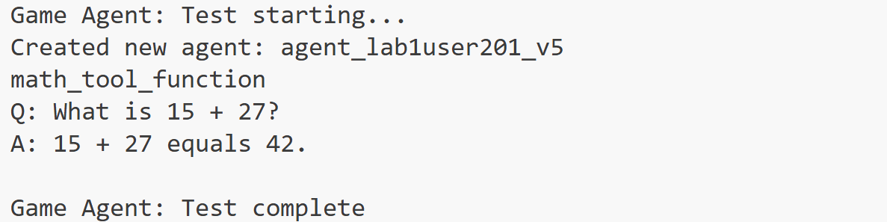

# Tool Use Design Pattern

Tools are interesting because they allow AI agents to have a broader range of capabilities. Instead of the agent having a limited set of actions it can perform, by adding a tool, the agent can now perform a wide range of actions. In this chapter, we will look at the Tool Use Design Pattern, which describes how AI agents can use specific tools to achieve their goals.

## What is the Tool Use Design Pattern?

The **Tool Use Design Pattern** focuses on giving LLMs the ability to interact with external tools to achieve specific goals. Tools are code that can be executed by an agent to perform actions. A tool can be a simple function such as a calculator, or an API call to a third-party service such as stock price lookup or weather forecast. In the context of AI agents, tools are designed to be executed by agents in response to **model-generated function calls**.

## What are the use cases it can be applied to?

AI Agents can leverage tools to complete complex tasks, retrieve information, or make decisions. The tool use design pattern is often used in scenarios requiring dynamic interaction with external systems, such as databases, web services, or code interpreters. This ability is useful for a number of different use cases including:

- **Dynamic Information Retrieval:** Agents can query external APIs or databases to fetch up-to-date data (e.g., querying a SQLite database for data analysis, fetching stock prices or weather information).
- **Code Execution and Interpretation:** Agents can execute code or scripts to solve mathematical problems, generate reports, or perform simulations.
- **Workflow Automation:** Automating repetitive or multi-step workflows by integrating tools like task schedulers, email services, or data pipelines.
- **Customer Support:** Agents can interact with CRM systems, ticketing platforms, or knowledge bases to resolve user queries.
- **Content Generation and Editing:** Agents can leverage tools like grammar checkers, text summarizers, or content safety evaluators to assist with content creation tasks.

## What are the elements/building blocks needed to implement the tool use design pattern?

These building blocks allow the AI agent to perform a wide range of tasks. Let's look at the key elements needed to implement the Tool Use Design Pattern:

- **Function/Tool Schemas**: Detailed definitions of available tools, including function name, purpose, required parameters, and expected outputs. These schemas enable the LLM to understand what tools are available and how to construct valid requests.

- **Function Execution Logic**: Governs how and when tools are invoked based on the user’s intent and conversation context. This may include planner modules, routing mechanisms, or conditional flows that determine tool usage dynamically.

- **Message Handling System**: Components that manage the conversational flow between user inputs, LLM responses, tool calls, and tool outputs.

- **Tool Integration Framework**: Infrastructure that connects the agent to various tools, whether they are simple functions or complex external services.

- **Error Handling & Validation**: Mechanisms to handle failures in tool execution, validate parameters, and manage unexpected responses.

- **State Management**: Tracks conversation context, previous tool interactions, and persistent data to ensure consistency across multi-turn interactions.

Next, let's look at Function/Tool Calling in more detail.
 
### Function/Tool Calling

Function calling is the primary way we enable Large Language Models (LLMs) to interact with tools. You will often see 'Function' and 'Tool' used interchangeably because 'functions' (blocks of reusable code) are the 'tools' agents use to carry out tasks. In order for a function's code to be invoked, an LLM must compare the users request against the functions description. To do this a schema containing the descriptions of all the available functions is sent to the LLM. The LLM then selects the most appropriate function for the task and returns its name and arguments. The selected function is invoked, it's response is sent back to the LLM, which uses the information to respond to the users request.

For developers to implement function calling for agents, you will need:

1. An LLM model that supports function calling
2. A schema containing function descriptions
3. The code for each function described

Let's use the example of getting the current time in a city to illustrate:

1. **Initialize an LLM that supports function calling:**

    Not all models support function calling, so it's important to check that the LLM you are using does.     <a href="https://learn.microsoft.com/azure/ai-services/openai/how-to/function-calling" target="_blank">Azure OpenAI</a> supports function calling. We can start by initiating the Azure OpenAI client. 

    ```python
    # Initialize the Azure OpenAI client
    client = AzureOpenAI(
        azure_endpoint = os.getenv("AZURE_OPENAI_API_ENDPOINT"), 
        api_key=os.getenv("AZURE_OPENAI_API_KEY"),  
        api_version="2024-05-01-preview"
    )
    ```

1. **Create a Function Schema**:

    Next we will define a JSON schema that contains the function name, description of what the function does, and the names and descriptions of the function parameters.
    We will then take this schema and pass it to the client created previously, along with the users request to find the time in San Francisco. What's important to note is that a **tool call** is what is returned, **not** the final answer to the question. As mentioned earlier, the LLM returns the name of the function it selected for the task, and the arguments that will be passed to it.

    ```python
    function_schema = [
        {
            "name": "get_current_time",
            "description": "Get the current time in a given city.",
            "parameters": {
                "type": "object",
                "properties": {
                    "city": {
                        "type": "string",
                        "description": "The name of the city to get the current time for."
                    }
                },
                "required": ["city"]
            }
        }
    ]

    messages = [
        {"role": "system", "content": "You are a helpful assistant."},
        {"role": "user", "content": "What time is it in San Francisco?"}
    ]

    response = client.chat.completions.create(
        model="gpt-4o",
        messages=messages,
        tools=function_schema,
        tool_choice="auto"
    )

    print(response.choices[0].message.tool_calls)

    ```
  
1. **The function code required to carry out the task:**

    Now that the LLM has chosen which functions need to be run, the code that carries out the RPS tournament tasks needs to be implemented and executed.
    We can implement the code to answer tournament questions and select optimal moves. We will also need to write the code to extract the name and arguments from the response_message to get the final result.

     ```python
    def get_current_time(city):
        from datetime import datetime
        import pytz

        city_timezones = {
            "San Francisco": "America/Los_Angeles",
            "New York": "America/New_York",
            "London": "Europe/London"
        }
        tz = pytz.timezone(city_timezones.get(city, "UTC"))
        return datetime.now(tz).strftime("%Y-%m-%d %H:%M:%S")

        response_message = {
            "tool_calls": [
                {
                    "name": "get_current_time",
                    "arguments": {"city": "San Francisco"}
                }
            ]
        }

        tool_call = response_message["tool_calls"][0]
        result = None
        if tool_call["name"] == "get_current_time":
            result = get_current_time(tool_call["arguments"]["city"])

        print(result)
     ```

Function Calling is at the heart of most, if not all agent tool use design, however implementing it from scratch can sometimes be challenging.
As we learned earlier in agentic frameworks provide us with pre-built building blocks to implement tool use.
 
## Tool Use Examples with Agentic Frameworks

Here are some examples of how you can implement the Tool Use Design Pattern using different agentic frameworks:

### Foundry Agent Service

<a href="https://learn.microsoft.com/azure/ai-foundry/agents/overview?view=foundry" target="_blank">Foundry Agent Service</a> is a production-ready managed runtime for building, deploying, and operating AI agents. It abstracts infrastructure complexity by handling conversation runtime components (agents, threads, messages, and runs), tool orchestration, and enterprise controls in a single service.

When compared to developing directly with LLM APIs, Foundry Agent Service provides advantages such as:

- Server-side tool orchestration and retries for supported tools.
- Managed conversation state with threads, messages, and runs.
- Built-in observability and tracing integrations.
- Security and governance controls including guardrails, RBAC, and support for bring-your-own resources.

The tools available in Foundry Agent Service can be divided into two categories:

1. Knowledge Tools:
    - <a href="https://learn.microsoft.com/azure/ai-foundry/agents/how-to/tools/bing-grounding?pivots=python" target="_blank">Grounding with Bing Search</a>
    - <a href="https://learn.microsoft.com/azure/ai-foundry/agents/how-to/tools/file-search?pivots=python" target="_blank">File Search</a>
    - <a href="https://learn.microsoft.com/azure/ai-foundry/agents/how-to/tools/azure-ai-search?pivots=python" target="_blank">Azure AI Search</a>

2. Action Tools:
    - <a href="https://learn.microsoft.com/azure/ai-foundry/agents/how-to/tools/function-calling?pivots=python" target="_blank">Function Calling</a>
    - <a href="https://learn.microsoft.com/azure/ai-foundry/agents/how-to/tools/code-interpreter?pivots=python" target="_blank">Code Interpreter</a>
    - <a href="https://learn.microsoft.com/azure/ai-foundry/agents/how-to/tools/openapi-spec?pivots=python" target="_blank">OpenAPI-defined tools</a>
    - <a href="https://learn.microsoft.com/azure/ai-foundry/agents/how-to/tools/azure-functions?pivots=python" target="_blank">Azure Functions</a>

Agent Service lets you combine these tools in the same agent and use thread-based state to maintain multi-turn conversations.

Imagine you are a sales agent at a company called Contoso. You want to develop a conversational agent that can answer questions about your sales data.

The following image illustrates how you could use Foundry Agent Service to analyze your sales data:


To use tools with the service, create an agent with tool definitions and then handle run execution for the thread. The following snippet matches the lab implementation pattern in `game_agent_v5_tool.py`.

```python
tools = self._setup_tools()
self.agent = self.project_client.agents.create_agent(
    model=self.model_deployment_name,
    name=self.agent_name,
    instructions="You are a helpful assistant.",
    tools=tools
)

run = self.project_client.agents.runs.create(
    thread_id=self.thread.id,
    agent_id=self.agent.id
)

if run.status == "requires_action":
    self.project_client.agents.runs.submit_tool_outputs(
        thread_id=self.thread.id,
        run_id=run.id,
        tool_outputs=tool_outputs
    )
```

#### Improve AI Agent Service Agent to have math calculation tools

- navigate to `labs/40-AIAgents` folder, open `game_agent_v5_tool.py` file.

```python
cd labs/40-AIAgents
```

- run the agent and see the console output.

```python
python game_agent_v5_tool.py
```


- the agent can now use a dedicated math calculation tool to answer the question rather than relying only on base model reasoning.


### Semantic Kernel

<a href="https://learn.microsoft.com/semantic-kernel/overview/" target="_blank">Semantic Kernel</a> is an open-source AI framework for .NET, Python, and Java developers working with Large Language Models (LLMs). It simplifies the process of using function calling by automatically describing your functions and their parameters to the model through a process called <a href="https://learn.microsoft.com/semantic-kernel/concepts/ai-services/chat-completion/function-calling/?pivots=programming-language-python#1-serializing-the-functions" target="_blank">serializing</a>. It also handles the back-and-forth communication between the model and your code. Another advantage of using an agentic framework like Semantic Kernel, is that it allows you to access pre-built tools like <a href="https://github.com/microsoft/semantic-kernel/blob/main/python/samples/getting_started_with_agents/openai_assistant/step4_assistant_tool_file_search.py" target="_blank">File Search</a> and <a href="https://github.com/microsoft/semantic-kernel/blob/main/python/samples/getting_started_with_agents/openai_assistant/step3_assistant_tool_code_interpreter.py" target="_blank">Code Interpreter</a>.

The following diagram illustrates the process of function calling with Semantic Kernel:


In Semantic Kernel functions/tools are called <a href="https://learn.microsoft.com/semantic-kernel/concepts/plugins/?pivots=programming-language-python" target="_blank">Plugins</a>. We can convert the RPS tournament functions we saw earlier into a plugin by turning them into a class with the functions in it. We can also import the `kernel_function` decorator, which takes in the description of the function. When you then create a kernel with the RPSTournamentPlugin, the kernel will automatically serialize the functions and their parameters, creating the schema to send to the LLM in the process.

```python
    from semantic_kernel import Kernel, kernel_function, Plugin

    class MathCalcPlugin(Plugin):
        @kernel_function(
            description="Calculate the result of a math expression.",
            name="calculate",
            parameters={
                "expression": {
                    "type": "string",
                    "description": "The math expression to evaluate, e.g. '2 + 2 * 3'"
                }
            }
        )
        def calculate(self, expression: str) -> str:
            return str(eval(expression))

    kernel = Kernel()
    kernel.add_plugin(MathCalcPlugin())

    result = kernel.invoke("calculate", {"expression": "12 * (3 + 2)"})
    print(result)
```
  
## What are the special considerations for using the Tool Use Design Pattern to build trustworthy AI agents?

A common concern with SQL dynamically generated by LLMs is security, particularly the risk of SQL injection or malicious actions, such as dropping or tampering with the database. While these concerns are valid, they can be effectively mitigated by properly configuring database access permissions. For most databases this involves configuring the database as read-only. For database services like PostgreSQL or Azure SQL, the app should be assigned a read-only (SELECT) role.

Running the app in a secure environment further enhances protection. In enterprise scenarios, data is typically extracted and transformed from operational systems into a read-only database or data warehouse with a user-friendly schema. This approach ensures that the data is secure, optimized for performance and accessibility, and that the app has restricted, read-only access.
