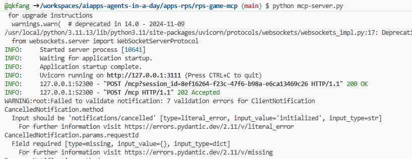
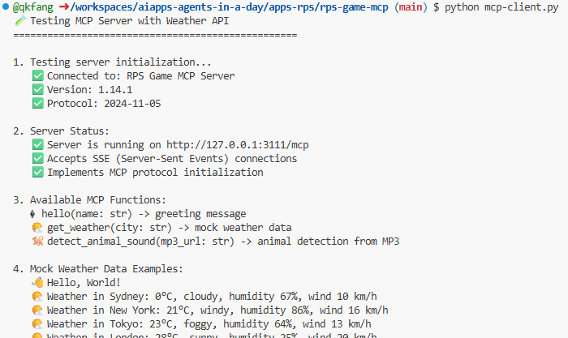
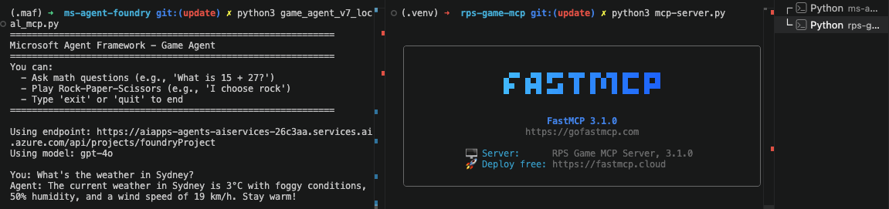

# Agentic Protocols

As the use of AI agents grows, so does the need for protocols that ensure standardization, security, and support open innovation. In this lesson we will cover three protocols that aim to meet this need: Model Context Protocol (MCP), Agent-to-Agent (A2A), and Natural Language Web (NLWeb).

:::tip Related Content
This section covers open protocols for standardized agent communication. For multi-agent orchestration patterns and design within a single system, see [Section 6: Multi-Agent Orchestration](../6-multi-agent/README.md).
:::

## Model Context Protocol

The **Model Context Protocol (MCP)** is an open standard that provides a standardized way for applications to provide context and tools to LLMs. This enables a "universal adapter" to different data sources and tools that AI agents can connect to in a consistent way.

Let’s look at the components of MCP, the benefits compared to direct API usage, and an example of how AI agents might use an MCP server.

### MCP Core Components

MCP operates on a **client-server architecture** and the core components are:

• **Hosts** are LLM applications (for example a code editor like VSCode) that start the connections to an MCP Server.

• **Clients** are components within the host application that maintain one-to-one connections with servers.

• **Servers** are lightweight programs that expose specific capabilities.

Included in the protocol are three core primitives which are the capabilities of an MCP Server:

• **Tools**: These are discrete actions or functions an AI agent can call to perform an action. For example, a weather service might expose a "get weather" tool, or an e-commerce server might expose a "purchase product" tool. MCP servers advertise each tool's name, description, and input/output schema in their capabilities listing.

• **Resources**: These are read-only data items or documents that an MCP server can provide, and clients can retrieve them on demand. Examples include file contents, database records, or log files. Resources can be text (like code or JSON) or binary (like images or PDFs).

• **Prompts**: These are predefined templates that provide suggested prompts, allowing for more complex workflows.

### Benefits of MCP

MCP offers significant advantages for AI Agents:

• **Dynamic Tool Discovery**: Agents can dynamically receive a list of available tools from a server along with descriptions of what they do. This contrasts with traditional APIs, which often require static coding for integrations, meaning any API change necessitates code updates. MCP offers an "integrate once" approach, leading to greater adaptability.

• **Interoperability Across LLMs**: MCP works across different LLMs, providing flexibility to switch core models to evaluate for better performance.

• **Standardized Security**: MCP includes a standard authentication method, improving scalability when adding access to additional MCP servers. This is simpler than managing different keys and authentication types for various traditional APIs.

### MCP Example


Imagine a player wants to get tournament assistance using an AI agent powered by MCP.

1. **Connection**: The RPS Tournament Agent (the MCP client) connects to an MCP server provided by a tournament knowledge service.

2. **Tool Discovery**: The client asks the knowledge service's MCP server, "What tools do you have available?" The server responds with tools like "answer_question", "analyze_strategy", and "get_opponent_stats".

3. **Tool Invocation**: The tournament presents a question: "What is the capital of France?" The RPS Agent, using its LLM, identifies that it needs to call the "answer_question" tool and passes the relevant parameters (question, difficulty_level) to the MCP server.

4. **Execution and Response**: The MCP server, acting as a wrapper, makes the actual call to the knowledge service's internal database API. It then receives the answer information (e.g., JSON data with answer and confidence) and sends it back to the RPS Agent.

5. **Further Interaction**: The RPS Agent receives the answer "Paris" with high confidence. For the same round, it might also invoke the "analyze_strategy" tool on the same MCP server to determine the optimal Rock/Paper/Scissors move, completing the tournament round submission.

### Create Game MCP server

- Open a new terminal window and navigate to `apps-rps/rps-game-mcp`.

```bash
cd apps-rps/rps-game-mcp
```

- Create and activate a virtual environment.

```bash
python -m venv .venv
```
```bash
# Windows
source .venv/Scripts/activate
```
```bash
# macOS / Linux
source .venv/bin/activate
```

- Install Python packages. All required packages are listed in `requirements.txt`; they are used by the labs in this module.

```bash
pip install -r requirements.txt
```

- Run the MCP server and observe the console output.

```bash
python mcp-server.py
```


- Open a new terminal window and navigate to `apps-rps/rps-game-mcp`.

```bash
cd apps-rps/rps-game-mcp
```

- Run the MCP client and observe the console output. The client connects to the server and retrieves the list of exposed tools.

```bash
python mcp-client.py
```



### Connect local MCP to Microsoft Agent Framework.

- Keep a terminal running with the `mcp-server.py` file and open another terminal to navigate to `labs/40-AIAgents/ms-agent-foundry` and activate the virtual environment set up earlier.

```bash
cd labs/40-AIAgents/ms-agent-foundry
```
```bash
# Windows
source .maf/Scripts/activate
```
```bash
# macOS / Linux
source .maf/bin/activate
```

- review the file - for localised development the code can now call the MCP tool for additional testing.



### Connect AI Agent to MCP server

- Navigate to `labs/40-AIAgents` and open `game_agent_v7_mcp.py`.

```bash
cd labs/40-AIAgents
```

- The agent can connect to hosted MCP servers and use the tools exposed by the server to complete actions.

```python
    # Initialize agent MCP tool
    mcp_server_url = os.environ.get("MCP_SERVER_URL", "https://gitmcp.io/Azure/azure-rest-api-specs")
    mcp_server_label = os.environ.get("MCP_SERVER_LABEL", "azure")

    self.mcp_tool = McpTool(
        server_label=mcp_server_label,
        server_url=mcp_server_url,
        allowed_tools=[]
    )
    
    tools.extend(self.mcp_tool.definitions)
```

- This MCP server allows you to get details for the Azure REST API specs. Run `python game_agent_v7_mcp.py` to see the agent leverage the MCP tools.

```bash
python game_agent_v7_mcp.py
```

## Agent-to-Agent Protocol (A2A)

While MCP focuses on connecting LLMs to tools, the **Agent-to-Agent (A2A) protocol** takes it a step further by enabling communication and collaboration between different AI agents. A2A can connect AI agents across different organizations, environments and tech stacks to complete a shared task.

We’ll examine the components and benefits of A2A, along with an example of how it could be applied in our travel application.

### A2A Core Concepts

A2A focuses on standardized communication between agents. The core concepts are:

#### Agent Card

An Agent Card is a discovery document that describes an agent's identity, skills, supported interfaces, capabilities, and authentication requirements.

#### Task

A Task is a stateful unit of work with a lifecycle, used for long-running or multi-turn interactions.

#### Message

A Message is a single communication turn between a client and a remote agent, containing user or agent content.

#### Part

A Part is the content container used inside messages and artifacts, supporting text, file references, and structured data.

#### Artifact

An Artifact is the concrete output of a task, such as text, structured data, or files.

#### Update Delivery Mechanisms

Task updates can be delivered through polling (Get Task), streaming (Server-Sent Events), and optional push notifications (webhooks).

#### Notes on Implementation Terms

Terms like Agent Executor, task stores, and event queues are common implementation patterns in SDKs and frameworks, but they are not mandatory protocol primitives.

### Benefits of A2A

• **Enhanced Collaboration**: It enables agents from different vendors and platforms to interact, share context, and work together, facilitating seamless automation across traditionally disconnected systems.

• **Model Flexibility**: Agents can be implemented with different internal models or runtimes, because A2A is model-agnostic.

• **Security by Standard Web Practices**: Authentication and authorization requirements are declared through the agent card and enforced using standard web security approaches.

### A2A Example


Let's expand on our RPS tournament scenario, but this time using A2A to coordinate multiple specialized agents.

1. **User Request to Multi-Agent**: A tournament coordinator interacts with a "Tournament Manager" A2A client/agent, perhaps by saying, "Please handle the complete tournament round for all 10 players, including question validation, strategy analysis, and performance tracking".

2. **Orchestration by Tournament Manager**: The Tournament Manager receives this complex request. It uses its LLM to reason about the task and determine that it needs to interact with other specialized agents for different aspects of tournament management.

3. **Inter-Agent Communication**: The Tournament Manager then uses the A2A protocol to connect to downstream agents, such as a "Question Specialist Agent," a "Strategy Analysis Agent," and a "Performance Monitor Agent" that could be created by different organizations or use different AI models.

4. **Delegated Task Execution**: The Tournament Manager sends specific tasks to these specialized agents (e.g., "Validate all player answers for this question," "Analyze optimal moves for current game state," "Track player performance metrics"). Each of these specialized agents could be running on different LLMs and utilizing their own tools (which could be MCP servers themselves), performs its specific part of the tournament management.

5. **Consolidated Response**: Once all downstream agents complete their tasks, the Tournament Manager compiles the results (answer validations, strategic recommendations, performance reports) and sends a comprehensive response back to the tournament coordinator with complete round results and insights.

### Create the A2A Service

Now let's build a practical A2A implementation where we create two agents that communicate via the A2A protocol.

- Navigate to `labs/40-AIAgents/a2a` folder

```bash
cd labs/40-AIAgents/a2a
```

- Set up a virtual environment and activate it

```python
python -m venv .a2a
```
```bash
# Windows
source .a2a/Scripts/activate
```
```bash
# macOS / Linux
source .a2a/bin/activate
```

- Install required dependencies

```bash
pip install -r requirements.txt
```

- Run the `main.py` script. This will start two agents: one that communicates directly with you via the terminal, and another that exposes tools for querying.

```bash
python main.py
```

You should see output confirming the service started:

```
============================================================
🚀 Starting Game Agent A2A System
============================================================

🚀 Starting server subprocesses...
🚀 Starting game_tools_agent_server on port 8088
INFO:     Started server process [92972]
INFO:     Waiting for application startup.
INFO:     Application startup complete.
INFO:     Uvicorn running on http://localhost:8088 (Press CTRL+C to quit)
INFO:     ::1:56072 - "GET /health HTTP/1.1" 200 OK
✅ game_tools_agent_server is healthy and ready!

============================================================
✅ All servers are ready!
============================================================

============================================================
Rock-Paper-Scissors Game Agent (A2A Demo)
============================================================
Connecting to Game Tools Agent via A2A protocol...

INFO:     ::1:56074 - "GET /.well-known/agent-card.json HTTP/1.1" 200 OK
✓ Discovered remote agent: GameToolsAgent
  Description: A specialized assistant for Rock-Paper-Scissors tournament. I can help with calculations, game rules, and tournament information.
  Skills: Calculate, RPS Rules, Tournament Info
✓ A2A connection established to http://localhost:8088

Game Agent ready! You can ask about:
  - Calculations (e.g., 'What is 5 + 7?')
  - RPS rules (e.g., 'Does rock beat scissors?')
  - Tournament info (e.g., 'What are the tournament rules?')

Type your questions or 'quit' to exit.
============================================================
```

### Understand the A2A Implementation

The A2A protocol implementation consists of two components:

**1. Game Tools Agent Server:**

`game_tools_agent/server.py` and `game_tools_agent/agent_executor.py` acts as an A2A server that other agents can connect to:

- **Starlette-based A2A Server:** Uses `A2AStarletteApplication` to expose the standard A2A endpoints.
- **Agent Card:** Publishes the `GameToolsAgent` card with three advertised skills: `calculate`, `rps_rules`, and `tournament_info`.
- **Request Handling:** Uses `DefaultRequestHandler` and `InMemoryTaskStore` to manage incoming requests and task state.
- **Agent Executor:** Routes each incoming text message to direct Python functions for math, RPS rules, or tournament info.

**2. Game Agent Client:**

`game_agent.py` acts as an A2A client that discovers and uses remote agents:

```python
# Step 1: Connect to the remote A2A agent and discover its card
self.httpx_client = httpx.AsyncClient(timeout=60.0)
client_config = ClientConfig(httpx_client=self.httpx_client)

self.agent_client = await ClientFactory.connect(
    self.tools_service_url,
    client_config=client_config
)

self.agent_card = await self.agent_client.get_card()
print(f"✓ Discovered remote agent: {self.agent_card.name}")

# Step 2: Send a message to the remote agent
message = Message(
    messageId=str(uuid.uuid4()),
    role="user",
    parts=[TextPart(text=user_message)]
)

async for event in self.agent_client.send_message(message):
    ...
```

### Key Differences: A2A vs MCP

Understanding when to use A2A versus MCP:

| Aspect | MCP | A2A |
|--------|-----|-----|
| **Purpose** | Connect agents to tools and data sources | Connect agents to other agents |
| **Communication** | Agent → Tool (one-way execution) | Agent ↔ Agent (bidirectional conversation) |
| **Context** | Typically tool input/output context per invocation | Supports multi-turn context through task and context identifiers |
| **Use Case** | Accessing databases, APIs, services | Delegating complex tasks to specialized agents |

**When to use A2A:**
- You need agents across different organizations to collaborate
- Tasks require back-and-forth reasoning between agents
- You want agent-level authentication and security

**When to use MCP:**
- You need to connect an agent to tools and data sources
- You're building integrations within a single application
- You need standardized access to various resources

## Natural Language Web (NLWeb)

Websites have long been the primary way for users to access information and data across the internet.

Let us look at the different components of NLWeb, the benefits of NLWeb and an example how our NLWeb works by looking at our travel application.

### Components of NLWeb

- **NLWeb Application (Core Service Code)**: The system that processes natural language questions. It connects the different parts of the platform to create responses. You can think of it as the **engine that powers the natural language features** of a website.

- **NLWeb Protocol**: This is a **basic set of rules for natural language interaction** with a website. It sends back responses in JSON format (often using Schema.org). Its purpose is to create a simple foundation for the “AI Web,” in the same way that HTML made it possible to share documents online.

- **MCP Server (Model Context Protocol Endpoint)**: Each NLWeb setup also works as an **MCP server**. This means it can **share tools (like an “ask” method) and data** with other AI systems. In practice, this makes the website’s content and abilities usable by AI agents, allowing the site to become part of the wider “agent ecosystem.”

- **Embedding Models**: These models are used to **convert website content into numerical representations called vectors** (embeddings). These vectors capture meaning in a way computers can compare and search. They are stored in a special database, and users can choose which embedding model they want to use.

- **Vector Database (Retrieval Mechanism)**: This database **stores the embeddings of the website content**. When someone asks a question, NLWeb checks the vector database to quickly find the most relevant information. It gives a fast list of possible answers, ranked by similarity. NLWeb works with different vector storage systems such as Qdrant, Snowflake, Milvus, Azure AI Search, and Elasticsearch.

### NLWeb by Example


Consider our travel booking website again, but this time, it's powered by NLWeb.

1. **Data Ingestion**: The travel website's existing product catalogs (e.g., flight listings, hotel descriptions, tour packages) are formatted using Schema.org or loaded via RSS feeds. NLWeb's tools ingest this structured data, create embeddings, and store them in a local or remote vector database.

2. **Natural Language Query (Human)**: A user visits the website and, instead of navigating menus, types into a chat interface: "Find me a family-friendly hotel in Honolulu with a pool for next week".

3. **NLWeb Processing**: The NLWeb application receives this query. It sends the query to an LLM for understanding and simultaneously searches its vector database for relevant hotel listings.

4. **Accurate Results**: The LLM helps to interpret the search results from the database, identify the best matches based on "family-friendly," "pool," and "Honolulu" criteria, and then formats a natural language response. Crucially, the response refers to actual hotels from the website's catalog, avoiding made-up information.

5. **AI Agent Interaction**: Because NLWeb serves as an MCP server, an external AI travel agent could also connect to this website's NLWeb instance. The AI agent could then use the `ask` MCP method to query the website directly: `ask("Are there any vegan-friendly restaurants in the Honolulu area recommended by the hotel?")`. The NLWeb instance would process this, leveraging its database of restaurant information (if loaded), and return a structured JSON response.

